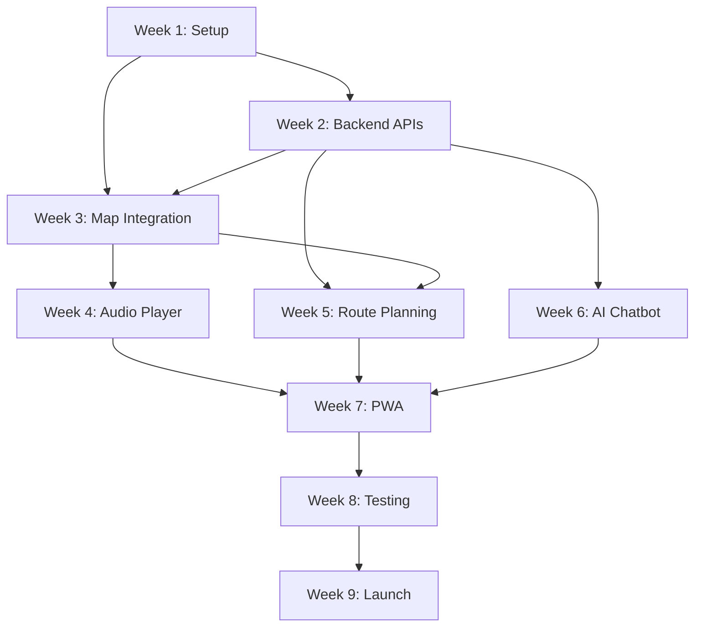

# Phân Công Nhiệm Vụ - DiDuDuaDi Web App

## Timeline: 9 Tuần (MVP Development)

---

## Team Structure

| Role                | Member                  | Responsibilities                              |
| ------------------- | ----------------------- | --------------------------------------------- |
| **Frontend Lead**   | Developer A             | React, UI/UX implementation, Maps integration |
| **Backend Lead**    | Developer B             | .NET Core API, Database, AI/RAG integration   |
| **Designer/DevOps** | Developer C (Part-time) | UI/UX Design, CI/CD, Infrastructure setup     |

---

## Week 1: Project Setup & Foundation (Feb 7-13, 2026)

### 🎯 Objective: Thiết lập môi trường phát triển và kiến trúc cơ bản

### Developer A (Frontend)

- [ ] **Setup React Project**
  - Khởi tạo React project với Vite
  - Cấu hình TypeScript
  - Setup ESLint + Prettier
  - Config folder structure
  ```
  src/
  ├── components/
  ├── pages/
  ├── services/
  ├── hooks/
  ├── utils/
  └── types/
  ```
- [ ] **Install Core Dependencies**
  - React Router v6
  - Axios / React Query
  - Material-UI / Tailwind CSS
  - react-i18next
- [ ] **Setup State Management**
  - Redux Toolkit hoặc Zustand
  - Configure store structure
- [ ] **Create Base Components**
  - Layout component (Header, Footer, Sidebar)
  - Loading spinner
  - Error boundary

**Time Estimate**: 40 hours  
**Deliverable**: React app running on `localhost:3000` với basic routing

---

### Developer B (Backend)

- [ ] **Setup .NET Project**
  - Tạo ASP.NET Core Web API project (.NET 8)
  - Configure solution structure:
  ```
  DiDuDuaDi.API/
  DiDuDuaDi.Core/        (Domain models)
  DiDuDuaDi.Infrastructure/  (Data access)
  DiDuDuaDi.Application/     (Business logic)
  ```
- [ ] **Database Setup**
  - Install PostgreSQL hoặc SQL Server
  - Setup Entity Framework Core
  - Install NetTopologySuite (for spatial data)
- [ ] **Create Initial Models**
  ```csharp
  public class POI {
      public Guid Id { get; set; }
      public Dictionary<string, string> Name { get; set; }
      public Point Location { get; set; }
      public string Category { get; set; }
      // ... other properties
  }
  ```
- [ ] **Database Migration**
  - Create initial migration
  - Seed sample data (5 POIs)
- [ ] **Setup Swagger/OpenAPI**
  - Configure Swashbuckle
  - API documentation

**Time Estimate**: 40 hours  
**Deliverable**: API running on `localhost:5000` với Swagger UI, database có sample data

---

### Developer C (Designer/DevOps)

- [ ] **UI/UX Design** (20 hours)
  - Wireframes cho 5 màn hình chính:
    - Home/Map View
    - POI List
    - POI Detail
    - Chat Interface
    - Settings
  - Design system (colors, typography, spacing)
  - Component design (buttons, cards, inputs)
- [ ] **DevOps Setup** (20 hours)
  - Setup Git repository structure
  - GitHub Actions CI/CD:
    - Frontend: Build + Deploy to Vercel/Netlify
    - Backend: Build + Test
  - Setup development environments:
    - Dev
    - Staging
    - Production
  - Docker Compose for local development

**Time Estimate**: 40 hours  
**Deliverable**: Figma designs, CI/CD pipeline working

---

### Team Meeting

- **Monday**: Kickoff meeting, clarify requirements
- **Wednesday**: Mid-week sync, address blockers
- **Friday**: Demo basic setup, retrospective

---

## Week 2: Core Backend APIs (Feb 14-20, 2026)

### 🎯 Objective: Xây dựng REST APIs cơ bản cho POI management

### Developer A (Frontend)

- [ ] **API Client Setup**
  - Configure Axios base instance
  - Setup React Query hooks
  - Create API service layer:
  ```typescript
  // services/poiService.ts
  export const poiService = {
    getAll: () => api.get("/pois"),
    getById: (id) => api.get(`/pois/${id}`),
    getNearby: (lat, lng, radius) =>
      api.get(`/pois/nearby?lat=${lat}&lng=${lng}&radius=${radius}`),
  };
  ```
- [ ] **Create POI List Page**
  - POI card component
  - List view với filters
  - Loading states
  - Error handling
- [ ] **Internationalization Setup**
  - Configure i18next
  - Create translation files (vi.json, en.json)
  - Language switcher component
- [ ] **Responsive Layout**
  - Mobile-first approach
  - Breakpoints setup
  - Test trên multiple screen sizes

**Time Estimate**: 40 hours  
**Deliverable**: POI list page hiển thị data từ API, có thể switch ngôn ngữ

---

### Developer B (Backend)

- [ ] **POI CRUD APIs**
  ```csharp
  [ApiController]
  [Route("api/[controller]")]
  public class POIsController {
      [HttpGet]
      public async Task<ActionResult<List<POIDto>>> GetAll();

      [HttpGet("{id}")]
      public async Task<ActionResult<POIDto>> GetById(Guid id);

      [HttpGet("nearby")]
      public async Task<ActionResult<List<POIDto>>> GetNearby(
          double lat, double lng, int radius);

      [HttpGet("categories")]
      public async Task<ActionResult<List<string>>> GetCategories();
  }
  ```
- [ ] **Spatial Queries Implementation**
  - ST_Distance queries
  - ST_DWithin for radius search
  - Optimize với spatial indexes
- [ ] **DTOs và AutoMapper**
  - Create DTO classes
  - Setup AutoMapper profiles
  - Input validation với FluentValidation
- [ ] **CORS Configuration**
  - Enable CORS cho frontend origin
- [ ] **Error Handling Middleware**
  - Global exception handler
  - Standardized error responses
- [ ] **Unit Tests**
  - Test POI service methods
  - Test spatial query logic
  - xUnit + Moq

**Time Estimate**: 40 hours  
**Deliverable**: Full CRUD API cho POIs, documented trong Swagger, có unit tests

---

### Developer C (Designer/DevOps)

- [ ] **Complete High-Fidelity Designs** (20 hours)
  - POI detail page mockup
  - Map view với markers
  - Chat interface
  - Mobile views
  - Interactive prototype
- [ ] **Database Backup Strategy** (10 hours)
  - Setup automated backups
  - Backup retention policy
  - Test restore process

- [ ] **Monitoring Setup** (10 hours)
  - Application Insights hoặc Sentry
  - Log aggregation
  - Basic dashboards

**Time Estimate**: 40 hours  
**Deliverable**: Complete design system, monitoring tools configured

---

## Week 3: Map Integration & Frontend Core (Feb 21-27, 2026)

### 🎯 Objective: Tích hợp Google Maps và hoàn thiện frontend core features

### Developer A (Frontend)

- [ ] **Google Maps Integration**
  - Setup Google Maps API key
  - Install `@react-google-maps/api`
  - Create Map component:
  ```typescript
  <GoogleMap
    center={center}
    zoom={15}
    onLoad={onMapLoad}
  >
    {pois.map(poi => (
      <Marker
        key={poi.id}
        position={poi.location}
        onClick={() => handleMarkerClick(poi)}
      />
    ))}
  </GoogleMap>
  ```
- [ ] **GPS Location Tracking**
  - Request geolocation permission
  - Watch user position
  - Display user marker on map
  - Handle errors (permission denied, timeout)
- [ ] **POI Detail Page**
  - Image gallery
  - Audio player controls (prepare UI, logic later)
  - Description sections
  - Directions button
  - Share button
- [ ] **Map Clustering** (optional)
  - Cluster nearby markers when zoomed out
  - Use `@react-google-maps/marker-clusterer`
- [ ] **Navigation Between Views**
  - Click marker → open POI detail
  - List view ↔ Map view toggle
  - Deep linking support

**Time Estimate**: 40 hours  
**Deliverable**: Interactive map với user location, POI markers, navigation flow hoàn chỉnh

---

### Developer B (Backend)

- [ ] **File Upload API**
  - Azure Blob Storage / AWS S3 integration
  - Upload image endpoint
  - Upload audio endpoint
  - Resize images (thumbnails)
  - Validate file types và sizes
- [ ] **Media Management**

  ```csharp
  [HttpPost("upload/image")]
  public async Task<ActionResult<string>> UploadImage(IFormFile file);

  [HttpPost("upload/audio")]
  public async Task<ActionResult<string>> UploadAudio(IFormFile file);
  ```

- [ ] **CDN Configuration**
  - Setup Azure CDN / CloudFront
  - Configure caching policies
  - URL signing for security
- [ ] **POI Content Management**
  - Admin endpoints (if needed)
  - Batch update translations
  - Audio file associations
- [ ] **Performance Optimization**
  - Query optimization
  - Add database indexes
  - Response caching với Redis (basic)
  - Pagination support

**Time Estimate**: 40 hours  
**Deliverable**: Media upload working, POIs có hình ảnh, CDN configured

---

### Developer C (Designer/DevOps)

- [ ] **Content Creation** (30 hours)
  - Viết content cho 15 POIs (Vietnamese + English)
  - Thu thập/chụp ảnh (5 ảnh/POI)
  - Organize media files
  - Upload lên storage

- [ ] **Frontend Deployment** (10 hours)
  - Deploy React app lên Vercel/Netlify
  - Configure custom domain (optional)
  - Setup environment variables
  - Test production build

**Time Estimate**: 40 hours  
**Deliverable**: 15 POIs với content đầy đủ, frontend accessible online

---

## Week 4: Audio Player & Proximity Features (Feb 28 - Mar 6, 2026)

### 🎯 Objective: Implement audio guide và proximity detection

### Developer A (Frontend)

- [ ] **Audio Player Implementation**
  - Integrate Howler.js
  - Create AudioPlayer component:
  ```typescript
  const AudioPlayer = ({ audioUrl, onEnd }) => {
    const [playing, setPlaying] = useState(false);
    const [progress, setProgress] = useState(0);
    // Play, pause, seek, volume controls
  };
  ```
- [ ] **Audio Controls UI**
  - Play/Pause button
  - Progress bar với seek
  - Speed control (0.75x, 1x, 1.25x, 1.5x)
  - Volume control
  - Download for offline
- [ ] **Proximity Detection Logic**
  ```typescript
  useEffect(() => {
    if (userLocation && selectedPOI) {
      const distance = calculateDistance(userLocation, selectedPOI.location);
      if (distance < 30) {
        // 30 meters
        showProximityNotification(selectedPOI);
        // Auto-play audio if enabled
      }
    }
  }, [userLocation, selectedPOI]);
  ```
- [ ] **Notification System**
  - Browser notifications (Web Notifications API)
  - In-app notification banner
  - Permission handling
- [ ] **Audio Preloading**
  - Preload audio cho nearby POIs
  - Smart buffering strategy

**Time Estimate**: 40 hours  
**Deliverable**: Working audio player, proximity triggers hoạt động

---

### Developer B (Backend)

- [ ] **Audio Processing Pipeline**
  - Audio file compression
  - Format conversion (MP3/AAC)
  - Metadata extraction
  - Generate waveform data (optional)
- [ ] **Proximity API Enhancements**
  ```csharp
  [HttpPost("nearby/check")]
  public async Task<ActionResult<ProximityResponse>> CheckProximity(
      LocationDto userLocation) {
      // Return POIs user is near
      // Include audio URLs ready to play
  }
  ```
- [ ] **Audio Streaming Support**
  - Range requests support
  - Adaptive bitrate (optional)
- [ ] **Analytics API**
  - Track POI visits
  - Track audio plays
  - Track user paths
  ```csharp
  [HttpPost("analytics/visit")]
  public async Task LogVisit(VisitDto visit);
  ```
- [ ] **Caching Strategy**
  - Redis caching for frequently accessed POIs
  - Cache invalidation logic

**Time Estimate**: 40 hours  
**Deliverable**: Audio delivery optimized, analytics tracking working

---

### Developer C (Designer/DevOps)

- [ ] **Audio Content Creation** (30 hours)
  - Record audio guides cho 5-7 POIs quan trọng nhất
  - Vietnamese + English versions
  - Professional voice hoặc TTS (Azure TTS)
  - Audio editing: noise reduction, normalization
  - Upload lên storage

- [ ] **Backend Deployment** (10 hours)
  - Deploy .NET API lên Azure App Service / AWS
  - Configure database connection strings
  - Setup SSL certificate
  - Health check endpoints

**Time Estimate**: 40 hours  
**Deliverable**: Audio guides available, backend in production

---

## Week 5: Route Planning & Navigation (Mar 7-13, 2026)

### 🎯 Objective: Implement lộ trình gợi ý và turn-by-turn navigation

### Developer A (Frontend)

- [ ] **Route Planning UI**
  - Route list page (3-5 pre-defined routes)
  - Route card component:
    - Thumbnail image
    - Duration
    - Distance
    - Difficulty
    - POI count
  - Route detail page:
    - Map với route path
    - POI stops list
    - Start button
- [ ] **Custom Route Builder** (optional)
  - Select POIs để tạo route
  - Drag to reorder stops
  - Save custom route
- [ ] **Navigation Mode**
  - Turn-by-turn directions
  - Progress tracking (visited POIs)
  - Next stop indicator
  - ETA calculation
  - Navigation bar với:
    - Current POI
    - Next POI
    - Distance to next
- [ ] **Route Visualization**
  - Draw polyline trên map
  - Highlight current segment
  - Animated user marker

**Time Estimate**: 40 hours  
**Deliverable**: Route planning working, users có thể follow routes

---

### Developer B (Backend)

- [ ] **Route Management APIs**

  ```csharp
  [HttpGet("routes")]
  public async Task<ActionResult<List<RouteDto>>> GetAllRoutes();

  [HttpGet("routes/{id}")]
  public async Task<ActionResult<RouteDetailDto>> GetRouteById(Guid id);

  [HttpPost("routes/optimize")]
  public async Task<ActionResult<RouteDto>> OptimizeRoute(
      List<Guid> poiIds);
  ```

- [ ] **Route Optimization Algorithm**
  - Implement simple TSP solver:
    - Nearest neighbor algorithm
    - Hoặc use Google Directions API
  - Calculate total distance và duration
  - Consider opening hours
- [ ] **Directions Integration**
  - Google Directions API integration
  - Parse directions response
  - Return step-by-step instructions
- [ ] **Route Database Schema**
  ```csharp
  public class Route {
      public Guid Id { get; set; }
      public Dictionary<string, string> Name { get; set; }
      public List<Guid> POISequence { get; set; }
      public int DurationMinutes { get; set; }
      public int DistanceMeters { get; set; }
      public string Difficulty { get; set; }
  }
  ```
- [ ] **Seed Route Data**
  - Create 3-5 pre-defined routes
  - Add route descriptions

**Time Estimate**: 40 hours  
**Deliverable**: Route APIs working, route optimization functional

---

### Developer C (Designer/DevOps)

- [ ] **Route Content Creation** (20 hours)
  - Design 5 themed routes:
    1. Food Tour (2h, 8 stops)
    2. Cultural Heritage (1.5h, 6 stops)
    3. Family Friendly (1h, 5 stops)
    4. Evening Walk (1h, 7 stops)
    5. Express Tour (30min, 4 stops)
  - Write descriptions (Vi + En)
  - Create route thumbnails
- [ ] **Load Testing** (10 hours)
  - Setup k6 hoặc JMeter
  - Test API under load:
    - 100 concurrent users
    - 1000 requests/minute
  - Identify bottlenecks
  - Performance report

- [ ] **Documentation** (10 hours)
  - API documentation updates
  - User guide draft
  - Deployment documentation

**Time Estimate**: 40 hours  
**Deliverable**: Routes documented, performance tested

---

## Week 6: AI Chatbot Foundation (Mar 14-20, 2026)

### 🎯 Objective: Setup RAG system và basic chatbot

### Developer A (Frontend)

- [ ] **Chat UI Components**
  - Floating chat button
  - Chat window (collapsible)
  - Message bubbles (user vs bot)
  - Typing indicator
  - Quick reply buttons
  ```typescript
  const ChatInterface = () => (
    <ChatWindow>
      <MessageList>
        {messages.map(msg => (
          <MessageBubble
            key={msg.id}
            sender={msg.sender}
            content={msg.content}
          />
        ))}
      </MessageList>
      <ChatInput onSend={handleSend} />
    </ChatWindow>
  );
  ```
- [ ] **Chat State Management**
  - Conversation history
  - WebSocket connection (optional)
  - Polling for messages
  - Message persistence (localStorage)
- [ ] **Rich Message Support**
  - Display images in chat
  - POI cards trong chat
  - Action buttons (Show on map, Get directions)
- [ ] **Context Awareness**
  - Send user location với query
  - Send current POI context

**Time Estimate**: 40 hours  
**Deliverable**: Chat UI hoàn chỉnh, connected to backend

---

### Developer B (Backend)

- [ ] **LLM Integration Setup**
  - Setup OpenAI API / Azure OpenAI
  - Create AIService:
  ```csharp
  public class AIService {
      private readonly OpenAIClient _openAI;
      private readonly IVectorDatabase _vectorDb;

      public async Task<string> GetChatResponse(
          string userMessage,
          string language,
          LocationDto userLocation);
  }
  ```
- [ ] **Vector Database Setup**
  - Choose: Pinecone / Azure AI Search / Weaviate
  - Setup connection
  - Create indexes
- [ ] **Knowledge Base Preparation**
  - Extract POI content
  - Generate embeddings:
  ```csharp
  foreach (var poi in pois) {
      var text = $"{poi.Name} {poi.Description}";
      var embedding = await GetEmbedding(text);
      await _vectorDb.UpsertAsync(poi.Id, embedding, metadata: poi);
  }
  ```

  - Store embeddings trong vector DB
- [ ] **RAG Pipeline**
  ```
  User Query
    → Embed Query
    → Vector Search (top 5 results)
    → Build Prompt với context
    → LLM Call
    → Return Response
  ```
- [ ] **Chat API Endpoint**
  ```csharp
  [HttpPost("chat")]
  public async Task<ActionResult<ChatResponseDto>> Chat(
      ChatRequestDto request) {
      var response = await _aiService.GetChatResponse(
          request.Message,
          request.Language,
          request.UserLocation
      );
      return Ok(response);
  }
  ```
- [ ] **Response Caching**
  - Semantic cache (similar queries)
  - Reduce LLM costs

**Time Estimate**: 45 hours (complex)  
**Deliverable**: Basic chatbot working, có thể answer questions about POIs

---

### Developer C (Designer/DevOps)

- [ ] **Knowledge Base Content** (25 hours)
  - Tổng hợp FAQ (50-100 questions)
  - Additional context về khu vực:
    - Lịch sử Vĩnh Khánh
    - Văn hóa địa phương
    - Tips for tourists
  - Format cho vector DB

- [ ] **Cost Monitoring** (10 hours)
  - Setup budget alerts (Azure/AWS)
  - Monitor LLM API usage
  - Dashboard for costs
  - Implement rate limiting

- [ ] **Security Audit** (5 hours)
  - API key security
  - CORS validation
  - Input sanitization
  - SQL injection prevention check

**Time Estimate**: 40 hours  
**Deliverable**: Rich knowledge base, cost monitoring active

---

## Week 7: PWA & Offline Support (Mar 21-27, 2026)

### 🎯 Objective: Convert to PWA và implement offline capabilities

### Developer A (Frontend)

- [ ] **Service Worker Setup**
  - Install `vite-plugin-pwa` hoặc `workbox`
  - Configure caching strategies:

  ```javascript
  // service-worker.js
  workbox.routing.registerRoute(
    ({ request }) => request.destination === "image",
    new workbox.strategies.CacheFirst(),
  );

  workbox.routing.registerRoute(
    ({ url }) => url.pathname.startsWith("/api/pois"),
    new workbox.strategies.NetworkFirst(),
  );
  ```

- [ ] **Offline Page**
  - Custom offline fallback page
  - Show cached POIs
  - Indicate offline status
- [ ] **Background Sync** (optional)
  - Queue analytics events when offline
  - Sync khi có network
- [ ] **App Install Prompt**
  - PWA install banner
  - "Add to Home Screen" prompt
  - Custom install UI
- [ ] **Offline Data Storage**
  - IndexedDB for POI data
  - Cache audio files (user-selected)
  - Download manager UI:
    - Select languages to download
    - Select POIs to cache
    - Show storage usage
- [ ] **Offline Map Support**
  - Cache map tiles (limited area)
  - Show downloaded area indicator

**Time Estimate**: 40 hours  
**Deliverable**: PWA installable, basic offline functionality working

---

### Developer B (Backend)

- [ ] **Offline-Ready APIs**
  - Versioning support (client checks version)
  - Bulk download endpoints:
  ```csharp
  [HttpPost("offline/package")]
  public async Task<ActionResult<OfflinePackage>> GenerateOfflinePackage(
      OfflinePackageRequest request) {
      // Package POIs, audio URLs, map data
      // Return JSON bundle
  }
  ```
- [ ] **Sync API**
  - Accept batched analytics
  - Return delta updates (new POIs, updated content)
- [ ] **Compression**
  - Gzip responses
  - Brotli compression
- [ ] **API Rate Limiting**
  - Implement rate limiting middleware
  - Protect against abuse
  ```csharp
  [RateLimit(10, TimeWindow.Minute)]
  [HttpPost("chat")]
  public async Task<IActionResult> Chat(...);
  ```

**Time Estimate**: 35 hours  
**Deliverable**: Backend optimized cho offline scenarios

---

### Developer C (Designer/DevOps)

- [ ] **PWA Assets** (15 hours)
  - App icons (multiple sizes)
  - Splash screens
  - manifest.json configuration
  - Screenshots for app stores (optional)
- [ ] **Performance Optimization** (15 hours)
  - Lighthouse audit
  - Optimize images (WebP, lazy loading)
  - Code splitting
  - Bundle size analysis
  - Improve Core Web Vitals:
    - LCP < 2.5s
    - FID < 100ms
    - CLS < 0.1

- [ ] **Database Optimization** (10 hours)
  - Query optimization
  - Index analysis
  - Connection pooling tuning
  - Database backup verification

**Time Estimate**: 40 hours  
**Deliverable**: PWA fully optimized, Lighthouse score > 90

---

## Week 8: Testing & Bug Fixes (Mar 28 - Apr 3, 2026)

### 🎯 Objective: Comprehensive testing và fix critical bugs

### Developer A (Frontend)

- [ ] **Unit Tests**
  - Test utility functions
  - Test custom hooks
  - Test Redux/Zustand stores
  - Target: >70% code coverage
  ```typescript
  // Example: useGeolocation.test.ts
  describe("useGeolocation", () => {
    it("should return user location", async () => {
      const { result } = renderHook(() => useGeolocation());
      await waitFor(() => {
        expect(result.current.location).toBeDefined();
      });
    });
  });
  ```
- [ ] **Integration Tests**
  - Test API integration
  - Test user flows:
    - View POI list → Select POI → View detail → Play audio
    - Start route → Navigate to POI → Complete route
    - Open chat → Ask question → Get response
- [ ] **E2E Tests** (Playwright/Cypress)
  - Critical user journeys
  - Cross-browser testing
- [ ] **Accessibility Testing**
  - Screen reader testing
  - Keyboard navigation
  - Color contrast
  - ARIA labels
- [ ] **Responsive Testing**
  - Test trên iOS Safari, Chrome Android
  - Test các screen sizes
  - Landscape/Portrait modes
- [ ] **Bug Fixes**
  - Fix issues from testing
  - Polish UI/UX
  - Performance improvements

**Time Estimate**: 40 hours  
**Deliverable**: Test suite complete, major bugs fixed

---

### Developer B (Backend)

- [ ] **Unit Tests**
  - Service layer tests
  - Repository tests
  - Spatial query tests
  - Target: >80% coverage
  ```csharp
  [Fact]
  public async Task GetNearbyPOIs_ReturnsCorrectResults() {
      // Arrange
      var service = new POIService(_mockRepo.Object);
      var userLocation = new Location(10.77, 106.70);

      // Act
      var result = await service.GetNearbyPOIs(userLocation, 500);

      // Assert
      Assert.NotEmpty(result);
      Assert.All(result, poi =>
          Assert.True(CalculateDistance(userLocation, poi.Location) <= 500));
  }
  ```
- [ ] **Integration Tests**
  - Test API endpoints
  - Test database operations
  - Test external service integrations (OpenAI, Storage)
- [ ] **Load Testing**
  - Simulate 100 concurrent users
  - Identify performance bottlenecks
  - Optimize slow queries
- [ ] **Security Testing**
  - Penetration testing (basic)
  - Input validation verification
  - Authentication/Authorization tests
- [ ] **API Contract Testing**
  - Ensure API matches OpenAPI spec
  - Backward compatibility checks
- [ ] **Bug Fixes**
  - Fix critical và high-priority bugs
  - Refactor code smells

**Time Estimate**: 40 hours  
**Deliverable**: Backend stable, tested, secure

---

### Developer C (Designer/DevOps)

- [ ] **User Acceptance Testing** (15 hours)
  - Recruit 5-10 beta testers
  - Create test scenarios
  - Collect feedback
  - Document issues

- [ ] **Production Readiness** (15 hours)
  - SSL certificate setup
  - CDN configuration verification
  - Database backup automation
  - Monitoring alerts configuration
  - Error tracking (Sentry) setup
  - Health check endpoints

- [ ] **Documentation** (10 hours)
  - User guide
  - Admin guide
  - Troubleshooting guide
  - API documentation final review

**Time Estimate**: 40 hours  
**Deliverable**: Production environment ready, documentation complete

---

## Week 9: Launch Preparation & Deployment (Apr 4-10, 2026)

### 🎯 Objective: Final polish và launch

### Developer A (Frontend)

- [ ] **Final Polish**
  - UI/UX tweaks based on feedback
  - Animations và transitions
  - Loading states refinement
  - Error messages improvement
- [ ] **SEO Optimization**
  - Meta tags (title, description, OG tags)
  - Sitemap generation
  - robots.txt
  - Structured data (JSON-LD)
- [ ] **Analytics Integration**
  - Google Analytics / Mixpanel
  - Event tracking:
    - Page views
    - POI views
    - Audio plays
    - Chat interactions
    - Route starts
- [ ] **Help & Onboarding**
  - Tutorial overlay cho first-time users
  - Help/FAQ page
  - Contact/Feedback form
- [ ] **Browser Compatibility Final Check**
  - Test trên all target browsers
  - Fix any remaining issues
- [ ] **Production Build**
  - Optimize build configuration
  - Generate production build
  - Verify all features working

**Time Estimate**: 40 hours  
**Deliverable**: Frontend production-ready

---

### Developer B (Backend)

- [ ] **Performance Final Tuning**
  - Cache warming
  - Query optimization
  - Connection pool tuning
  - Response compression verification
- [ ] **Data Migration to Production**
  - Migrate 15 POIs với full content
  - Migrate routes
  - Verify data integrity
- [ ] **API Rate Limiting Tuning**
  - Adjust limits based on testing
  - Implement tiered limits (if applicable)
- [ ] **Monitoring & Alerting**
  - Configure Application Insights / Datadog
  - Setup alerts:
    - High error rate
    - High response time
    - Database connection failures
    - LLM API failures
- [ ] **Backup & Disaster Recovery**
  - Verify automated backups
  - Test restore procedure
  - Document recovery steps
- [ ] **Production Deployment**
  - Deploy to production environment
  - Smoke testing
  - Monitor for issues

**Time Estimate**: 40 hours  
**Deliverable**: Backend in production, stable và monitored

---

### Developer C (Designer/DevOps)

- [ ] **Final Content Review** (10 hours)
  - Proofread all content
  - Verify translations accuracy
  - Check all media links working
  - Test audio quality

- [ ] **Launch Checklist** (10 hours)
  - [ ] SSL certificate active
  - [ ] Custom domain configured
  - [ ] DNS propagated
  - [ ] CDN working
  - [ ] Backups automated
  - [ ] Monitoring active
  - [ ] Error tracking working
  - [ ] Analytics tracking
  - [ ] All tests passing
  - [ ] Documentation complete
  - [ ] Team trained

- [ ] **Launch Plan Execution** (10 hours)
  - Coordinate deployment timing
  - Monitor launch
  - Quick response to issues
  - Verify all systems operational

- [ ] **Post-Launch Tasks** (10 hours)
  - Submit to search engines
  - Share with stakeholders
  - Prepare marketing materials
  - Plan post-launch monitoring schedule

**Time Estimate**: 40 hours  
**Deliverable**: App LIVE, post-launch monitoring active

---

### Team Activities

- **Monday**: Final planning, launch go/no-go decision
- **Wednesday**: Dry-run deployment to staging
- **Friday**: LAUNCH 🚀
- **Post-launch**: Daily monitoring for first week

---

## Post-Week 9: Maintenance & Iteration

### Week 10-12: Stabilization

- Monitor user feedback
- Fix bugs reported by users
- Performance optimization based on real usage
- Content expansion (add more POIs)

### Future Enhancements

- [ ] Expand to 15+ languages
- [ ] More audio guides (all POIs)
- [ ] User accounts & personalization
- [ ] Social features (reviews, ratings)
- [ ] Gamification (badges, achievements)
- [ ] AR features (camera overlay with POI info)

---

## Success Metrics (To Track Weekly)

| Metric                | Target   | Week 1 | Week 3 | Week 5 | Week 7 | Week 9 |
| --------------------- | -------- | ------ | ------ | ------ | ------ | ------ |
| **API Coverage**      | 100%     | 20%    | 60%    | 80%    | 95%    | 100%   |
| **Frontend Pages**    | 10 pages | 2      | 5      | 7      | 9      | 10     |
| **POIs with Content** | 15       | 0      | 5      | 10     | 15     | 15     |
| **Audio Guides**      | 7        | 0      | 0      | 3      | 5      | 7      |
| **Test Coverage**     | >70%     | 0%     | 20%    | 40%    | 60%    | 75%    |
| **Lighthouse Score**  | >90      | N/A    | N/A    | N/A    | 80     | 95     |

---

## Risk Management

### Weekly Risk Assessment

**Week 1-2 Risks:**

- ⚠️ Team unfamiliar với tech stack → Mitigation: Pair programming, code reviews
- ⚠️ Architecture decisions unclear → Mitigation: Spike solutions, ADRs

**Week 3-4 Risks:**

- ⚠️ Google Maps API costs → Mitigation: Monitor usage, set quotas
- ⚠️ GPS accuracy issues → Mitigation: Field testing early, fallback strategies

**Week 5-6 Risks:**

- ⚠️ LLM integration complex → Mitigation: Start simple, use managed services
- ⚠️ LLM costs exceed budget → Mitigation: Aggressive caching, rate limiting

**Week 7-8 Risks:**

- ⚠️ PWA issues on iOS → Mitigation: Graceful degradation, focus on responsive web
- ⚠️ Critical bugs found → Mitigation: Buffer time allocated, prioritize fixes

**Week 9 Risks:**

- ⚠️ Production deployment issues → Mitigation: Staging environment, rollback plan
- ⚠️ Last-minute scope creep → Mitigation: Feature freeze from Week 8

---

## Communication Plan

### Daily

- Stand-up meeting (15 min)
  - What did you do yesterday?
  - What will you do today?
  - Any blockers?

### Weekly

- **Monday**: Week planning, assign tasks
- **Wednesday**: Mid-week sync, address blockers
- **Friday**: Demo completed features, retrospective

### Tools

- **Slack/Discord**: Daily communication
- **GitHub**: Code reviews, issue tracking
- **Notion/Jira**: Task management
- **Figma**: Design collaboration
- **Google Meet/Zoom**: Video calls

---

## Definition of Done

Một task được coi là "Done" khi:

- ✅ Code được viết và tested locally
- ✅ Unit tests passed (nếu applicable)
- ✅ Code reviewed và approved
- ✅ Merged vào main branch
- ✅ Deployed to dev/staging environment
- ✅ Functionality verified by team
- ✅ Documentation updated (nếu cần)

---

## Notes & Best Practices

### Frontend

- **Component-driven development**: Build reusable components
- **Mobile-first**: Design for mobile, enhance for desktop
- **Accessibility**: ARIA labels, keyboard navigation từ đầu
- **Performance**: Code splitting, lazy loading images

### Backend

- **Clean Architecture**: Separation of concerns
- **SOLID Principles**: Maintainable, testable code
- **API versioning**: Plan for future changes
- **Security**: Input validation, SQL injection prevention, API key security

### DevOps

- **Infrastructure as Code**: Everything in Git
- **Continuous Integration**: Automated tests on every commit
- **Monitoring**: Log everything, alert on errors
- **Backup**: Automated, tested regularly

---

## Budget Tracking (9 Weeks)

| Category                               | Estimated Cost |
| -------------------------------------- | -------------- |
| **Development** (3 people × 9 weeks)   | $32,400        |
| **Infrastructure** (9 weeks × $340/mo) | $700           |
| **Content Creation**                   | $5,000         |
| **Tools & Services** (APIs, licenses)  | $1,000         |
| **Buffer (10%)**                       | $3,900         |
| **Total**                              | **~$43,000**   |

---

## Appendix: Task Dependencies



---

**Document Version**: 1.0  
**Created**: February 7, 2026  
**Team**: 3 Developers  
**Duration**: 9 Weeks  
**Status**: ✅ Ready to Execute

---

## Quick Reference: Who Does What

| Week | Frontend Focus | Backend Focus     | Designer/DevOps Focus |
| ---- | -------------- | ----------------- | --------------------- |
| 1    | React setup    | .NET setup        | Design + CI/CD        |
| 2    | POI list page  | CRUD APIs         | Designs + Monitoring  |
| 3    | Map + GPS      | File upload       | Content + Deploy      |
| 4    | Audio player   | Audio processing  | Audio recording       |
| 5    | Route planning | Route APIs        | Route content         |
| 6    | Chat UI        | RAG/AI setup      | Knowledge base        |
| 7    | PWA/Offline    | Offline APIs      | PWA assets            |
| 8    | Testing        | Testing           | UAT + Docs            |
| 9    | Polish + SEO   | Production deploy | Launch coordination   |

**Let's build something amazing! 🚀**
