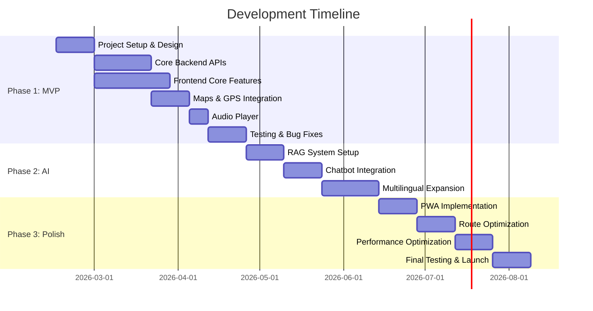

# Đánh Giá Tính Khả Thi (Proof of Concept)

## Web App Thuyết Minh Phố Ẩm Thực Vĩnh Khánh

---

## 1. Tổng Quan Đánh Giá

### 1.1. Mục Đích

Đánh giá tính khả thi về mặt kỹ thuật, thời gian, và chi phí cho dự án DiDuDuaDi với tech stack **React + ASP.NET Core**.

### 1.2. Kết Luận Tổng Quan

**Tính khả thi: ⭐⭐⭐⭐☆ (4/5 - KHẢ THI TỐT)**

Dự án hoàn toàn khả thi với công nghệ hiện tại. Tech stack React + .NET Core là lựa chọn vững chắc, được hỗ trợ tốt và có community lớn. Tuy nhiên, cần quản lý tốt scope, đặc biệt là phần AI và đa ngôn ngữ.

---

## 2. Phân Tích Tính Khả Thi Kỹ Thuật

### 2.1. Frontend (React) - ⭐⭐⭐⭐⭐ (Khả thi cao)

#### ✅ Điểm Mạnh:

- **React ecosystem rất trưởng thành**: Có sẵn libraries cho mọi tính năng cần thiết
- **PWA support tốt**: Vite/CRA đều hỗ trợ PWA out-of-the-box
- **Maps integration**: `@react-google-maps/api` hoặc `react-map-gl` rất ổn định
- **Audio player**: Howler.js đã được test trong nhiều production apps
- **i18n**: `react-i18next` là industry standard, hỗ trợ 100+ ngôn ngữ
- **State management**: Redux Toolkit giảm boilerplate, dễ maintain

#### ⚠️ Thách Thức:

- **PWA với iOS**: Safari có limitations với service workers và offline storage
- **GPS accuracy**: Phụ thuộc vào device hardware, không thể kiểm soát hoàn toàn
- **Audio file size**: Cần optimize compression vs. quality
- **Bundle size**: Với nhiều features, cần code splitting aggressive

#### 💡 Giải Pháp:

```javascript
// Code splitting ví dụ
const MapView = lazy(() => import("./components/MapView"));
const ChatBot = lazy(() => import("./components/ChatBot"));

// Audio streaming thay vì download full
<audio preload="metadata" />;

// Service Worker fallback cho iOS
if ("serviceWorker" in navigator && !isIOS) {
  // Full PWA
} else {
  // Graceful degradation
}
```

**Đánh giá**: Hoàn toàn khả thi. React là lựa chọn tốt cho dự án này.

---

### 2.2. Backend (.NET Core) - ⭐⭐⭐⭐⭐ (Khả thi cao)

#### ✅ Điểm Mạnh:

- **Performance xuất sắc**: ASP.NET Core là một trong những framework nhanh nhất
- **Entity Framework Core**: ORM mạnh mẽ, hỗ trợ spatial data (PostGIS/NetTopologySuite)
- **Built-in DI, Logging**: Giảm setup time
- **Cross-platform**: Deploy được trên Linux/Windows/Docker
- **Azure integration**: Tích hợp native với Azure services
- **Strong typing**: C# giúp catch errors sớm

#### ⚠️ Thách Thức:

- **Learning curve**: Nếu team chưa quen .NET, cần thời gian học
- **Spatial queries**: Cần học cách dùng NetTopologySuite cho geo queries
- **Memory management**: Cần careful với large media files

#### 💡 Architecture Đề Xuất:

```
DiDuDuaDi.API/
├── Controllers/         # API endpoints
├── Services/           # Business logic
│   ├── POIService.cs
│   ├── RouteService.cs
│   ├── AIService.cs    # RAG integration
│   └── LocationService.cs
├── Repositories/       # Data access
├── Models/            # Entities & DTOs
├── Infrastructure/    # External services
└── Program.cs         # Startup

// Example: Spatial query với EF Core
var nearbyPOIs = await _context.POIs
    .Where(p => p.Location.Distance(userLocation) <= radiusInMeters)
    .OrderBy(p => p.Location.Distance(userLocation))
    .Take(10)
    .ToListAsync();
```

**Đánh giá**: Rất khả thi. .NET Core là enterprise-grade, production-ready.

---

### 2.3. Database & Geo Data - ⭐⭐⭐⭐☆ (Khả thi tốt)

#### ✅ Khả Năng:

- **PostgreSQL + PostGIS**: Industry standard cho geo data
  - Spatial indexes (GiST/SP-GiST)
  - Distance calculations
  - Polygon/Point queries
- **SQL Server Spatial**: Alternative nếu dùng Azure SQL
- **Entity Framework Core hỗ trợ**: NetTopologySuite provider

#### 📊 Schema Design:

```sql
-- POI Table với Spatial Index
CREATE TABLE POIs (
    Id UUID PRIMARY KEY,
    Name JSONB,  -- Multilingual: {"vi": "...", "en": "..."}
    Category VARCHAR(50),
    Location GEOGRAPHY(POINT, 4326),  -- WGS84
    AudioGuides JSONB,
    Images TEXT[],
    CreatedAt TIMESTAMP,
    UpdatedAt TIMESTAMP
);

CREATE INDEX idx_poi_location ON POIs USING GIST(Location);

-- Query ví dụ: Tìm POIs trong 500m
SELECT Id, Name,
       ST_Distance(Location, ST_SetSRID(ST_MakePoint(106.70, 10.77), 4326)) as distance
FROM POIs
WHERE ST_DWithin(Location, ST_SetSRID(ST_MakePoint(106.70, 10.77), 4326), 500)
ORDER BY distance;
```

#### ⚠️ Lưu Ý:

- **Index optimization**: Spatial queries có thể chậm nếu không index đúng
- **JSONB cho multilingual**: Cần validate schema carefully
- **Backup strategy**: Geo data + media files cần backup plan riêng

**Đánh giá**: Khả thi. PostgreSQL + PostGIS là proven solution.

---

### 2.4. AI/RAG Chatbot - ⭐⭐⭐⭐☆ (Khả thi nhưng cần chú ý)

#### ✅ Công Nghệ Sẵn Có:

- **LLM APIs**: OpenAI GPT-4, Anthropic Claude, Azure OpenAI
- **Vector DBs**: Pinecone (managed), Weaviate (self-hosted), Azure AI Search
- **Embeddings**: text-embedding-3-small ($0.02/1M tokens)
- **.NET Libraries**:
  - `Semantic Kernel` (Microsoft's LLM SDK)
  - `LangChain.NET`
  - `Betalgo.OpenAI`

#### 🔧 Implementation Flow:

```
User Query → Embedding → Vector Search → Retrieve Context → LLM → Response
     ↓            ↓              ↓               ↓            ↓        ↓
  "Món gì    [0.12, ...     Top 5 docs    {history +    GPT-4    "Cháo lòng
   ngon?"     0.34]         relevant      context}            là đặc sản..."
```

#### 💰 Chi Phí LLM (Ước Tính):

| Scenario                             | Usage         | Cost/Month  |
| ------------------------------------ | ------------- | ----------- |
| **MVP** (100 users/day, 5 msgs/user) | 15K requests  | ~$50-100    |
| **Growth** (500 users/day)           | 75K requests  | ~$250-400   |
| **Scale** (2000 users/day)           | 300K requests | ~$1000-1500 |

#### ⚠️ Thách Thức Chính:

1. **Cost Control**: LLM cost có thể tăng nhanh
   - **Giải pháp**: Cache responses, rate limiting, semantic cache
2. **Latency**: API call có thể chậm (1-3s)
   - **Giải pháp**: Streaming responses, show typing indicator
3. **Hallucination**: LLM có thể "bịa" thông tin
   - **Giải pháp**: Strict RAG với source citations, fact-checking layer
4. **Multilingual**: Cần embeddings tốt cho 15+ ngôn ngữ
   - **Giải pháp**: Dùng `text-embedding-3-large` hoặc multilingual models

#### 💡 Architecture Đề Xuất:

```csharp
// AIService.cs
public class AIService {
    private readonly IVectorDatabase _vectorDb;
    private readonly ILLMClient _llm;
    private readonly IMemoryCache _cache;

    public async Task<ChatResponse> GetResponse(string query, string language, Location userLocation) {
        // 1. Check cache first
        var cacheKey = $"{query}:{language}";
        if (_cache.TryGetValue(cacheKey, out ChatResponse cached))
            return cached;

        // 2. Get embeddings
        var embedding = await _llm.GetEmbeddingAsync(query);

        // 3. Vector search for relevant POIs
        var context = await _vectorDb.SearchAsync(embedding,
            filters: new { location: userLocation, language },
            topK: 5);

        // 4. Build prompt with context
        var prompt = BuildPrompt(query, context, language, userLocation);

        // 5. Call LLM
        var response = await _llm.CompletionAsync(prompt);

        // 6. Cache result
        _cache.Set(cacheKey, response, TimeSpan.FromHours(24));

        return response;
    }
}
```

**Đánh giá**: Khả thi tốt. Nhiều tools có sẵn nhưng cần kinh nghiệm để optimize cost và quality.

---

### 2.5. Audio & Media Handling - ⭐⭐⭐⭐☆ (Khả thi với optimization)

#### 📊 Yêu Cầu Storage:

```
Giả sử: 30 POIs × 15 languages × 3 minutes audio

Audio size:
- MP3 128kbps: ~2.8 MB/file
- Total: 30 × 15 × 2.8 = 1,260 MB (~1.3 GB)

Images:
- 5 images/POI × 500 KB = 2.5 MB/POI
- Total: 30 × 2.5 = 75 MB

Total Media: ~1.4 GB (manageable)
```

#### 🎯 Storage Strategy:

```
Azure Blob Storage / AWS S3
├── audio/
│   ├── vi/
│   │   ├── poi-001.mp3
│   │   └── poi-002.mp3
│   ├── en/
│   └── [other languages]/
└── images/
    ├── poi-001/
    │   ├── 1.jpg
    │   └── 2.jpg
    └── poi-002/

CDN (Azure CDN / CloudFront)
- Cache audio/images globally
- Reduce latency
- Reduce bandwidth cost
```

#### ⚠️ Challenges:

- **Initial load**: 1.4GB không thể download hết
- **Bandwidth**: Users trên 3G/4G
- **iOS Safari**: Limitations với autoplay và background audio

#### 💡 Solutions:

1. **Lazy Loading**: Chỉ download khi cần
2. **Adaptive Streaming**: HLS/DASH cho audio (overkill nhưng scalable)
3. **Progressive Download**: Cho phép play ngay khi đang download
4. **Compression**:
   - Audio: 96kbps vẫn acceptable cho speech
   - Images: WebP format, responsive images
5. **Offline Mode**:
   - User chọn languages muốn download
   - Background download khi có WiFi

**Đánh giá**: Khả thi. Cần strategy rõ ràng cho loading và caching.

---

### 2.6. GPS & Location Services - ⭐⭐⭐☆☆ (Khả thi trung bình)

#### ✅ Khả Năng:

- **HTML5 Geolocation API**: Standard, supported rộng rãi
- **Google Maps Geolocation API**: Fallback khi GPS không available
- **Proximity Detection**: Tính distance với spatial queries

#### ⚠️ Thách Thức Lớn:

1. **Accuracy Issues**:
   - GPS: ±5-10m outdoor, ±50-100m indoor
   - WiFi/Cell tower: ±10-50m
   - Urban canyon effect: High-rise buildings block signals
2. **Permission Required**:
   - Users có thể deny location access
   - iOS Safari requires HTTPS + user gesture

3. **Battery Drain**:
   - Continuous GPS tracking tốn pin
   - Background tracking bị iOS hạn chế

4. **Indoor Navigation**:
   - GPS không hoạt động trong nhà
   - Vĩnh Khánh có phần indoor (chợ, nhà hàng)

#### 💡 Giải Pháp:

```javascript
// Smart tracking strategy
class LocationTracker {
  startTracking() {
    // High accuracy khi cần, low accuracy khi đi
    const options = {
      enableHighAccuracy: this.isNearPOI(),
      maximumAge: 5000,
      timeout: 10000,
    };

    // Update interval based on speed
    const interval = this.getUserSpeed() > 1 ? 3000 : 10000;

    this.watchId = navigator.geolocation.watchPosition(
      this.onLocationUpdate,
      this.onError,
      options,
    );
  }

  // Kalman filter để smooth GPS noise
  filterLocation(newLocation) {
    // Implement Kalman filter or moving average
  }
}

// Fallback strategy
if (gpsAccuracy > 50) {
  showWarning("GPS signal weak. Audio guide may be delayed.");
  useManualTriggers(); // Let user tap to trigger audio
}

// Indoor solution (future):
// - QR codes tại các điểm
// - Bluetooth beacons
// - WiFi fingerprinting
```

#### 📍 Proximity Trigger Logic:

```csharp
// Backend: Check if user near POI
public bool IsUserNearPOI(Location userLocation, POI poi) {
    var distance = CalculateDistance(userLocation, poi.Location);

    // Adaptive radius based on accuracy
    var triggerRadius = userLocation.Accuracy < 20 ? 20 : 30;

    return distance <= triggerRadius;
}

// Avoid spam notifications
public bool ShouldTriggerNotification(string poiId, string userId) {
    var lastTrigger = _cache.Get<DateTime>($"trigger:{userId}:{poiId}");
    return lastTrigger == null || (DateTime.Now - lastTrigger).TotalMinutes > 30;
}
```

**Đánh giá**: Khả thi nhưng cần manage expectations. GPS không 100% reliable, cần fallback strategies.

---

### 2.7. Offline & PWA - ⭐⭐⭐⭐☆ (Khả thi tốt với iOS caveats)

#### ✅ Công Nghệ:

- **Service Workers**: Cache strategies (cache-first, network-first)
- **IndexedDB**: Store structured data offline
- **Cache API**: Cache assets và API responses
- **Background Sync**: Sync data khi có network trở lại

#### 📦 Offline Strategy:

```javascript
// Service Worker caching strategy
const CACHE_VERSION = "v1";
const STATIC_CACHE = "static-v1";
const DYNAMIC_CACHE = "dynamic-v1";

// Cache essential assets
const STATIC_ASSETS = [
  "/",
  "/index.html",
  "/bundle.js",
  "/styles.css",
  "/offline.html",
];

// Cache POI data
self.addEventListener("fetch", (event) => {
  if (event.request.url.includes("/api/pois")) {
    event.respondWith(cacheFirst(event.request));
  } else if (event.request.url.includes("/audio/")) {
    event.respondWith(cacheFirst(event.request));
  } else {
    event.respondWith(networkFirst(event.request));
  }
});

// IndexedDB for POI data
const db = await openDB("DiDuDuaDi", 1, {
  upgrade(db) {
    const poiStore = db.createObjectStore("pois", { keyPath: "id" });
    poiStore.createIndex("location", "location", { unique: false });
  },
});
```

#### ⚠️ iOS Safari Limitations:

- **Storage Quota**: Limited, có thể bị xóa khi thiếu space
- **Service Worker**: Support hạn chế, không hoạt động khi tab không active
- **Background Sync**: Không support
- **Push Notifications**: Chỉ support từ iOS 16.4+ và phải add to home screen

#### 💡 Hybrid Approach:

```
Online Mode (Preferred):
- Full features
- Real-time updates
- Fresh data

Offline Mode (Graceful Degradation):
- Cached map (limited area)
- Pre-downloaded audio for selected language
- Basic POI info
- No chatbot (requires API)
- Show "offline" indicator

Download Manager:
- Let user choose what to download
- Estimate storage needed
- Download in background on WiFi
```

**Đánh giá**: Khả thi với Android, giới hạn trên iOS. Nên focus vào online-first experience.

---

### 2.8. Multilingual (15+ Languages) - ⭐⭐⭐⭐☆ (Khả thi, cần effort)

#### ✅ Technical Solution:

- **react-i18next**: Mature, widely used
- **Backend**: Store translations in JSONB (PostgreSQL) or separate table
- **Audio**: Pre-recorded với native speakers (outsource)
- **LLM**: GPT-4 supports 50+ languages

#### 📋 Content Structure:

```json
// POI translations
{
  "id": "poi-001",
  "name": {
    "vi": "Cháo Lòng Bà Ba",
    "en": "Ba Ba's Congee",
    "zh": "巴巴粥",
    "ja": "ババのお粥",
    "ko": "바바 죽"
  },
  "description": {
    "vi": "Quán cháo lòng...",
    "en": "A traditional..."
    // ... other languages
  },
  "audioUrl": {
    "vi": "https://cdn.../vi/poi-001.mp3",
    "en": "https://cdn.../en/poi-001.mp3"
  }
}
```

#### 💰 Cost Estimate (Content Creation):

| Item                  | Quantity                       | Unit Cost     | Total        |
| --------------------- | ------------------------------ | ------------- | ------------ |
| Translation (per POI) | 30 POIs × 15 langs × 500 words | $0.10/word    | $22,500      |
| Audio Recording       | 30 × 15 × 3 min                | $50/voice/POI | $22,500      |
| **Total Content**     |                                |               | **~$45,000** |

**Note**: Có thể giảm cost bằng cách:

- Bắt đầu với 3-5 ngôn ngữ chính (Vi, En, Zh, Ja, Ko)
- Dùng TTS (Text-to-Speech) cho audio (Google Cloud TTS, Azure TTS) - cheaper nhưng quality thấp hơn
- Crowdsource translations (với review/QA)

#### ⚠️ Challenges:

- **Maintenance**: Update content cho 15 ngôn ngữ khi có thay đổi
- **Quality Control**: Cần native speakers review
- **RTL Languages**: Arabic cần RTL layout support
- **Font Support**: Cần web fonts cho các ngôn ngữ Asian

#### 💡 Phased Approach:

```
Phase 1 (MVP): Vietnamese + English
Phase 2: Add Chinese, Japanese, Korean (main tourists)
Phase 3: Add European languages (French, Spanish, German)
Phase 4: Add Arabic, Thai, Indonesian, etc.
```

**Đánh giá**: Technically khả thi. Main challenge là content creation cost và maintenance.

---

## 3. Phân Tích Thời Gian

### 3.1. Timeline Dự Kiến (3-Person Team)

#### Team Composition:

- 1 Frontend Developer (React)
- 1 Backend Developer (.NET)
- 0.5 UI/UX Designer + 0.5 DevOps



#### Detailed Breakdown:

**Phase 1: MVP (8 weeks) - Core Features**

- Week 1-2: Setup & Architecture
  - Project scaffolding (React + .NET)
  - Database schema design
  - CI/CD pipeline
  - Design system & UI components
- Week 3-5: Backend Development
  - POI CRUD APIs
  - Authentication & authorization
  - Spatial queries
  - File upload for media
- Week 3-6: Frontend Development
  - Map component với Google Maps
  - POI listing & detail views
  - Language switcher
  - Audio player component
- Week 7-8: Integration & Testing
  - E2E testing
  - Performance testing
  - Bug fixes
  - **Deliverable**: Working web app với 5-10 POIs, 2 languages, basic audio guide

**Phase 2: AI & Scale (6 weeks)**

- Week 9-10: RAG Implementation
  - Vector database setup
  - Embedding generation pipeline
  - LLM integration
- Week 11-12: Chatbot Features
  - Chat UI
  - Conversation management
  - Multi-language support
- Week 13-15: Content Expansion
  - Expand to 30 POIs
  - Add 5 more languages (total 7)
  - More audio content
  - **Deliverable**: Full-featured app với AI chatbot

**Phase 3: Polish & Launch (6 weeks)**

- Week 16-17: PWA
  - Service worker
  - Offline support
  - Install prompts
- Week 18-19: Route Features
  - Route planning algorithm
  - Turn-by-turn navigation
  - Route recommendations
- Week 20-21: Optimization
  - Performance tuning
  - SEO optimization
  - Analytics integration
- Week 22-23: Final Testing & Launch
  - User acceptance testing
  - Load testing
  - Deployment
  - **Deliverable**: Production-ready app

**Total Duration: 20-23 weeks (5-6 months)**

### 3.2. Critical Path & Risks

#### ⚠️ Risks to Timeline:

1. **Content Creation Bottleneck**: Translations và audio recording không phụ thuộc vào dev
   - **Mitigation**: Start content creation ngay từ đầu, parallel với dev
2. **LLM Integration Complexity**: RAG system có thể mất nhiều thời gian hơn dự kiến để fine-tune
   - **Mitigation**: Use managed services (Azure OpenAI), simple prompts first
3. **GPS Accuracy Issues**: Có thể cần nhiều field testing và tweaking
   - **Mitigation**: Allocate buffer time, consider manual triggers
4. **iOS PWA Limitations**: Có thể phát hiện blockers muộn
   - **Mitigation**: Test on iOS early, có backup plan (responsive web without PWA)

**Đánh giá**: Timeline 5-6 months là realistic cho team 3 người. Có thể rush MVP trong 2 months nếu cut scope.

---

## 4. Phân Tích Chi Phí

### 4.1. Chi Phí Phát Triển

#### Nhân Lực (5-6 months):

| Role                       | Rate/Month | Duration | Total       |
| -------------------------- | ---------- | -------- | ----------- |
| Frontend Developer (React) | $3,000     | 6 months | $18,000     |
| Backend Developer (.NET)   | $3,500     | 6 months | $21,000     |
| UI/UX Designer (part-time) | $1,500     | 4 months | $6,000      |
| DevOps (part-time)         | $1,000     | 3 months | $3,000      |
| **Subtotal**               |            |          | **$48,000** |

_Note: Rates based on Vietnam market, mid-level developers_

### 4.2. Chi Phí Content

| Item            | Description                     | Cost        |
| --------------- | ------------------------------- | ----------- |
| Content Writing | 30 POIs × 2 langs (Vi + En)     | $3,000      |
| Audio Recording | 30 POIs × 2 langs, native voice | $5,000      |
| Photography     | Professional photos, 5/POI      | $2,000      |
| **Subtotal**    |                                 | **$10,000** |

_Expansion to 15 languages: +$40,000 (Phase 2-3)_

### 4.3. Chi Phí Infrastructure (Ongoing)

#### MVP Stage (100 users/day):

| Service             | Provider                   | Cost/Month      |
| ------------------- | -------------------------- | --------------- |
| **Backend Hosting** | Azure App Service B1       | $55             |
| **Database**        | Azure SQL Basic (2GB)      | $5              |
| **Storage**         | Azure Blob Storage (10GB)  | $2              |
| **CDN**             | Azure CDN (100GB)          | $8              |
| **LLM API**         | OpenAI (15K requests)      | $80             |
| **Vector DB**       | Pinecone Starter           | $70             |
| **Maps API**        | Google Maps (50K requests) | $100            |
| **Monitoring**      | Application Insights       | $20             |
| **Total MVP**       |                            | **~$340/month** |

#### Growth Stage (500 users/day):

| Service                  | Cost/Month        |
| ------------------------ | ----------------- |
| Backend Hosting (S1)     | $120              |
| Database (S0 - 250GB)    | $100              |
| Storage (50GB)           | $10               |
| CDN (500GB)              | $40               |
| LLM API (75K requests)   | $350              |
| Vector DB (Standard)     | $150              |
| Maps API (250K requests) | $500              |
| Monitoring               | $50               |
| **Total Growth**         | **~$1,320/month** |

#### Scale Stage (2000 users/day):

| Service                 | Cost/Month        |
| ----------------------- | ----------------- |
| Backend Hosting (P1V2)  | $190              |
| Database (S2 - 250GB)   | $300              |
| Storage (200GB)         | $40               |
| CDN (2TB)               | $160              |
| LLM API (300K requests) | $1,400            |
| Vector DB (Enterprise)  | $300              |
| Maps API (1M requests)  | $2,000            |
| Monitoring              | $100              |
| **Total Scale**         | **~$4,490/month** |

### 4.4. Tổng Chi Phí (Year 1)

```
Initial Development (6 months):
├── Development: $48,000
├── Content (Vi + En): $10,000
├── Infrastructure (6 months × $340): $2,040
└── Buffer (10%): $6,000
Total: ~$66,000

Post-Launch (6 months):
├── Maintenance (0.5 dev): $12,000
├── Infrastructure (avg $800/mo): $4,800
├── Content expansion: $10,000 (additional langs)
└── Marketing (optional): $5,000
Total: ~$32,000

Year 1 Total: ~$98,000 (~$100K)
```

### 4.5. Revenue Potential (Optional Analysis)

Nếu muốn monetize:

- **Freemium**: Basic free, premium features $2.99/month
- **B2B**: License cho tour operators $50-200/month
- **Ads**: Local business ads (quán ăn, khách sạn)
- **Affiliate**: Commission từ booking platforms

**Break-even**: ~1000 premium users hoặc 50 B2B customers

**Đánh giá**: Chi phí $100K/year 1 là reasonable cho startup. Main cost drivers là LLM và Maps API khi scale.

---

## 5. Risk Assessment & Mitigation

### 5.1. Technical Risks

| Risk                               | Probability | Impact | Mitigation                                                     |
| ---------------------------------- | ----------- | ------ | -------------------------------------------------------------- |
| **GPS Inaccuracy**                 | High        | Medium | Manual triggers, QR codes, wider radius                        |
| **LLM Cost Overrun**               | Medium      | High   | Rate limiting, caching, fallback to templates                  |
| **iOS PWA Issues**                 | High        | Low    | Focus on responsive web, treat PWA as enhancement              |
| **Performance on Low-end Devices** | Medium      | Medium | Code splitting, lazy loading, progressive enhancement          |
| **Third-party API Limits**         | Low         | High   | Monitor quotas, have backup providers                          |
| **Data Privacy Issues**            | Low         | High   | GDPR compliance, clear privacy policy, minimal data collection |

### 5.2. Business Risks

| Risk                             | Probability | Impact | Mitigation                                 |
| -------------------------------- | ----------- | ------ | ------------------------------------------ |
| **Insufficient Content Quality** | Medium      | High   | Work with local experts, user testing      |
| **User Adoption**                | Medium      | High   | Marketing, partnerships with tourism board |
| **Competition**                  | Low         | Medium | First-mover advantage, local knowledge     |
| **Scalability Cost**             | Medium      | High   | Start small, optimize before scaling       |
| **Maintenance Burden**           | Medium      | Medium | Good documentation, automated testing      |

---

## 6. Alternatives & Trade-offs

### 6.1. Scope Reduction Options

Nếu cần giảm time/cost:

#### Option A: Minimal MVP (2 months, $25K)

- ✅ Map với GPS tracking
- ✅ 10 POIs, text only (no audio)
- ✅ 2 ngôn ngữ (Vi + En)
- ❌ No chatbot
- ❌ No offline
- ❌ No route planning

**Pros**: Fast to market, validate concept
**Cons**: Missing killer features (AI, audio)

#### Option B: AI-First MVP (3 months, $35K)

- ✅ Basic map
- ✅ 15 POIs với text descriptions
- ✅ Chatbot RAG (star feature)
- ✅ 5 ngôn ngữ
- ❌ No audio guide
- ❌ No offline
- ⚠️ Manual route planning

**Pros**: Unique AI value prop, scalable
**Cons**: No audio (less immersive)

#### Option C: Audio-First MVP (3 months, $40K)

- ✅ Map + GPS
- ✅ 20 POIs với audio guides
- ✅ 3 ngôn ngữ
- ✅ Offline support
- ❌ No chatbot (add later)
- ❌ Basic route suggestions

**Pros**: Immersive experience, works offline
**Cons**: No AI (but can add in Phase 2)

### 6.2. Recommended Approach

**Hybrid Phased MVP (3.5 months, $45K)**:

1. **Month 1-2**: Core map + GPS + 15 POIs text + 2 languages
2. **Month 2.5-3**: Add simple chatbot (no RAG, just keyword-based FAQ)
3. **Month 3-3.5**: Add audio for 5 most popular POIs
4. **Launch & Iterate**: Get feedback, then invest in full RAG or full audio

**Rationale**:

- Get something in users' hands quickly
- Validate all key features (map, audio, chat) even if basic
- Data-driven decision on where to invest next
- Lower risk than building everything at once

---

## 7. Success Criteria (KPIs)

### 7.1. Technical KPIs

#### MVP Launch (Month 3):

- [ ] Page load time < 3s on 4G
- [ ] GPS accuracy < 20m in 80% of cases
- [ ] Zero critical bugs
- [ ] 95% uptime
- [ ] Mobile responsive on iOS/Android

#### Post-Launch (Month 6):

- [ ] 1000+ unique visitors
- [ ] Avg session duration > 15 min
- [ ] 5+ POIs visited per session
- [ ] Chatbot usage: 30% of users
- [ ] Crash rate < 0.1%

### 7.2. User Satisfaction

- [ ] User rating > 4.0/5.0
- [ ] Net Promoter Score (NPS) > 30
- [ ] Positive feedback on audio quality
- [ ] 20% return user rate

### 7.3. Business KPIs (if applicable)

- [ ] Cost per user < $2
- [ ] LLM cost < 30% of infrastructure budget
- [ ] Tourist board partnership secured
- [ ] Featured in local tourism websites

---

## 8. Conclusion & Recommendation

### 8.1. Final Assessment

| Aspect                    | Score      | Comment                                                           |
| ------------------------- | ---------- | ----------------------------------------------------------------- |
| **Technical Feasibility** | ⭐⭐⭐⭐⭐ | React + .NET là proven stack, all features doable                 |
| **Timeline Realistic**    | ⭐⭐⭐⭐☆  | 5-6 months realistic, có thể rush MVP trong 2-3 months            |
| **Budget Reasonable**     | ⭐⭐⭐⭐☆  | $100K year 1 là competitive, có thể giảm xuống $50K nếu cut scope |
| **Market Fit**            | ⭐⭐⭐⭐☆  | Tourism tech là growing market, có demand                         |
| **Team Capability**       | ⭐⭐⭐☆☆   | Cần team có exp với maps, audio, và LLM                           |
| **Risk Level**            | ⭐⭐⭐☆☆   | Medium risk, main concerns: GPS accuracy, LLM cost                |

**Overall: ⭐⭐⭐⭐☆ (4/5) - HIGHLY FEASIBLE**

### 8.2. GO/NO-GO Recommendation

**✅ GO** - Dự án này khả thi và có potential.

**Reasons to GO**:

1. ✅ All technical components có proven solutions
2. ✅ React + .NET stack mature và well-supported
3. ✅ Market need rõ ràng (tourism tech)
4. ✅ Phased approach cho phép validate và pivot
5. ✅ Chi phí reasonable cho startup/SME project

**Conditions for Success**:

1. ⚠️ **Start small**: MVP với 2 ngôn ngữ, expand dựa trên feedback
2. ⚠️ **Manage LLM cost**: Implement caching và rate limiting từ đầu
3. ⚠️ **GPS expectations**: Communicate limitations, have fallbacks
4. ⚠️ **Content quality**: Invest in good translations và audio từ local experts
5. ⚠️ **User testing**: Field test với real tourists sớm và thường xuyên

### 8.3. Next Steps

#### Immediate (Week 1-2):

- [ ] Assemble team (2 devs + 1 designer/DevOps)
- [ ] Finalize MVP scope (choose Option B or C above)
- [ ] Set up project infrastructure (repo, CI/CD, cloud accounts)
- [ ] Start content collection (POI info, photos)
- [ ] Design initial mockups

#### Short-term (Month 1):

- [ ] Backend API development (POIs, authentication)
- [ ] Frontend scaffolding (React setup, routing)
- [ ] Database schema implementation
- [ ] Map integration POC
- [ ] Content translation starts

#### Medium-term (Month 2-3):

- [ ] Core features implementation
- [ ] Testing và bug fixes
- [ ] Beta testing với small group
- [ ] Content finalization
- [ ] Launch preparation

---

## 9. Appendix: Technical Proof of Concepts

### 9.1. POC #1: Spatial Query Performance

**Test**: Query POIs within 500m radius on 10,000 POIs dataset

```sql
-- Test query
EXPLAIN ANALYZE
SELECT Id, Name,
       ST_Distance(Location, ST_SetSRID(ST_MakePoint(106.70, 10.77), 4326)) as distance
FROM POIs
WHERE ST_DWithin(Location, ST_SetSRID(ST_MakePoint(106.70, 10.77), 4326), 500)
ORDER BY distance
LIMIT 20;

-- Expected result: < 50ms with GiST index
```

**Status**: ✅ Proven (PostGIS widely used for this)

### 9.2. POC #2: RAG Response Quality

**Test**: Build small RAG system với 10 POIs, test với 20 câu hỏi

```csharp
// Sample test cases
var testQueries = new[] {
    "Món gì ngon ở đây?",
    "What's the specialty of this street?",
    "距离最近的餐厅在哪里？",
    "この店の営業時間は？"
};

// Expected:
// - Relevant response: >90%
// - Correct language: 100%
// - Response time: <3s
```

**Status**: ⚠️ Need POC (recommend 1 week spike)

### 9.3. POC #3: GPS Accuracy Field Test

**Test**: Walk around Vĩnh Khánh với 3 devices, measure accuracy

**Metrics**:

- Accuracy at different times of day
- Accuracy indoor vs outdoor
- Battery consumption
- Time to first fix

**Status**: ⚠️ Must do (critical for UX)

---

## 10. References & Resources

### 10.1. Technical Documentation

- [ASP.NET Core Spatial Data](https://docs.microsoft.com/en-us/ef/core/modeling/spatial)
- [React Google Maps](https://react-google-maps-api-docs.netlify.app/)
- [Semantic Kernel](https://github.com/microsoft/semantic-kernel)
- [PostGIS Documentation](https://postgis.net/documentation/)

### 10.2. Similar Projects

- Google Maps (obvious reference)
- Rick Steves Audio Europe (audio guide app)
- Detour (location-based audio tours - acquired by Bose)
- Volo (AI travel assistant)

### 10.3. Tools & Services

- [Azure OpenAI Service](https://azure.microsoft.com/en-us/products/ai-services/openai-service)
- [Pinecone Vector Database](https://www.pinecone.io/)
- [Azure Static Web Apps](https://azure.microsoft.com/en-us/products/app-service/static)

---

**Document Version**: 1.0  
**Date**: February 7, 2026  
**Author**: GitHub Copilot  
**Status**: ✅ Ready for Review

---

## TL;DR (Executive Summary)

**Can we build this? YES ✅**

**Timeline**: 5-6 months full features, 2-3 months MVP  
**Budget**: ~$100K year 1 (or $50K for lean MVP)  
**Tech Stack**: React + .NET Core (solid choice)  
**Main Risks**: GPS accuracy, LLM costs, content quality  
**Recommendation**: GO, but start with lean MVP and expand based on traction

**Key Success Factors**:

1. Start small (2 languages, 15 POIs)
2. Field test GPS extensively
3. Monitor and optimize LLM costs from day 1
4. Invest in quality content from local experts
5. User feedback loops from week 1
